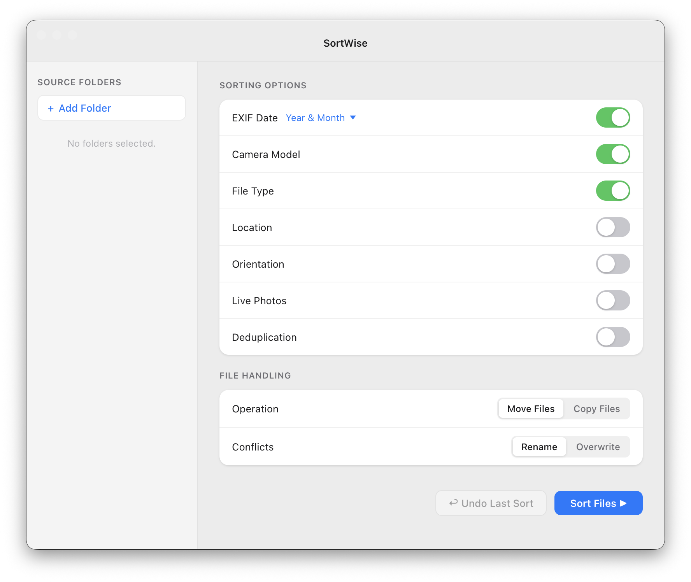

# SortWise - Photo Organizer for Mac

SortWise is a free Mac app that automatically sorts your photos and videos into folders. Point it at a messy folder of thousands of photos and it will organize everything by date, camera, location, file type, or any combination of those - in seconds.

No subscription. No cloud upload. Everything stays on your machine.

---

## Download

**[Download SortWise for Mac (Apple Silicon)](https://github.com/NoobAIDeveloper/SortWise/releases/latest)**

1. Open the `.dmg` file
2. Drag `SortWise.app` into your Applications folder
3. Right-click the app and choose **Open** the first time you run it (required because the app is not yet notarized with Apple)

---

## What it does

Most people end up with photos scattered across Downloads, Desktop, iCloud exports, old phone backups, and camera SD cards. SortWise takes all of that and puts it into a clean folder structure you actually want.

You pick the folders, choose how you want things sorted, and click Sort. That's it.

### Sorting options

- **Date** - Organizes by year and month (or just year) using the EXIF date embedded in the photo. Falls back to the file's modified date if there's no EXIF data.
- **Camera Model** - Creates a folder per device, so photos from your iPhone, DSLR, and GoPro end up separate.
- **File Type** - Splits photos, videos, GIFs, and screenshots into their own folders.
- **Location** - Uses GPS data in the photo to sort by country and city.
- **Orientation** - Separates landscape and portrait shots.
- **Live Photos** - Keeps the `.jpg` and `.mov` pairs together in a Live Photos folder.
- **Deduplication** - Skips files it has already seen in the same run, so you don't end up with duplicates.

### File handling

- **Move or Copy** - Move files to the new structure, or copy them and leave the originals in place.
- **Conflict resolution** - If a file with the same name already exists at the destination, SortWise either renames the incoming file (`photo_1.jpg`) or overwrites it, depending on what you pick.
- **Undo** - Every sort operation is logged. If you don't like the result, click Undo and everything goes back to where it was.

---

## How to use it

1. Click **+ Add Folder** and select the folder (or folders) you want to sort
2. Turn on the sorting options you want
3. Choose whether to Move or Copy files
4. Click **Sort Files**
5. If something looks wrong, click **Undo Last Sort** to reverse it

You can sort by multiple criteria at once. For example, sorting by Date and File Type will create a structure like `2023/06/Photos/` and `2023/06/Videos/`.

---

## FAQ

**Does it work on Intel Macs?**
The current release is built for Apple Silicon (M1/M2/M3/M4). An Intel build is not available yet but is on the roadmap.

**Will it delete my original photos?**
Only if you use Move mode. If you're unsure, use Copy mode first - it leaves all your originals exactly where they are.

**What file types does it support?**
JPG, JPEG, PNG, GIF, MOV, MP4, and AVI.

**Why does macOS say the app can't be opened?**
SortWise is not notarized with Apple yet. To open it, right-click the app and choose Open, then click Open again in the dialog. You only need to do this once.

**Is my data sent anywhere?**
No. The only network request SortWise makes is to OpenStreetMap's geocoding API (Nominatim) when you use Location sorting, to convert GPS coordinates into a city and country name. Nothing else leaves your computer.

---

## Built with

- [Electron](https://www.electronjs.org/) + [React](https://reactjs.org/) - desktop app and UI
- [Python](https://www.python.org/) - file operations and metadata processing
- [exifread](https://github.com/ianare/exif-py) - reading EXIF metadata
- [Pillow](https://python-pillow.org/) - image processing
- [geopy](https://geopy.readthedocs.io/) - GPS to location lookup

---

## Contributing

Bug reports and feature requests are welcome. Open an issue or submit a pull request.

---

## License

MIT - see [LICENSE.md](LICENSE.md)
